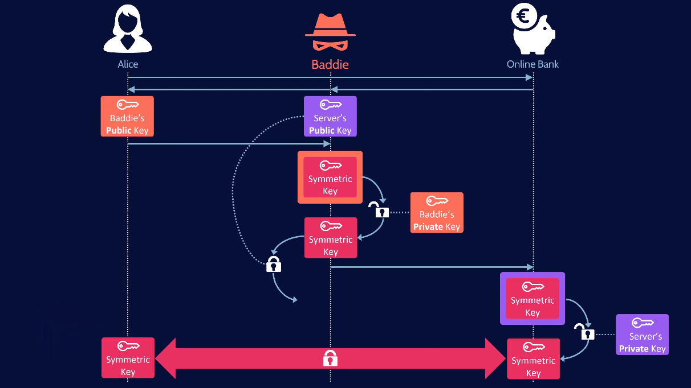

# Network Security Review Questions

## Abkürzungen

* A:
  * AEAD: Authenticated Encryption with Associated Data
  * AES: Advanced Encryption Standard
* C:
  * CBC: Cipher Block Chaining Mode
  * CTR: Counter Mode
    * CCM: Counter Mode with CBC-MAC
* D:
  * DES: Data Encryption Standard
  * DH: Diffie-Hellman
  * DLP: Discrete Logarithm Problem
  * DoS: Denial of Service
    * DDoS: Distributed Denial of Service
  * DNS: Domain Name System
    * DNSSEC: Domain Name System Security Extensions
  * DSA: Digital Signature Algorithm
* E:
  * ECB: Electronic Codebook Mode
  * ECC: Elliptic Curve Cryptography
    * ECDSA: Elliptic Curve Signature Algorithm
* F:
  * FIPS: Federal Information Processing Standard
  * FTP: File Transfer Protocol
    * FTPS: File Transfer Protocol over TLS
* G:
  * GCM: Galois Counter Mode
* I:
  * ID: Identity
  * IV: Initialization Vector
* J:
  * JWT: JSON Web Token
* K:
  * KPA: Known-plaintext Attacke
  * KSK: Key Signing Key
* O:
  * OIDC: OpenID Connect
* M:
  * MAC: Message Authentication Code
    * CBC-MAC: Cipher Block Chaining Message Authentication Code
    * GMAC: Galois Message Authentication Code
    * HMAC: Hashed Message Authentication Code
* N:
  * NIST: National Institute of Standard and Technology
* P:
  * PKCE: Proof Key for Code Exchange
  * PKC: Public Key Cryptography
  * PKI: Public Key Infrastructure
  * PGP: Pretty Good Protection
    * GPG: GNU PGP
* R:
  * RNG: Random Number Generator
    * PRNG: Pseudo-random Number Generator
  * RR: Round-Robin
  * RSA: Rivest, Shamir, Adleman-Algorithm
* S:
  * SAML: Security Assertion Markup Language
  * SOCKS: Sockets
  * SSH: Secure Shell
  * SSO: Single Sign-on
* Z:
  * ZSK: Zone Signing Key

## Kapitel 1

1. **Was versteht man unter Safety, was unter Security?**

   * Safety: Schutz vor Verlust von Daten, etwa durch Hardwarefehler
   * Security: Schutz vor unautorisiertem Zugriff, etwa auf private Informationen

2. **Geben Sie Beispiele!**

   * Safety: Backups, Checksummen
   * Security: Verschlüsselung, Anti-Virus

3. **Nennen Sie die sieben Ziele der Netzwerksicherheit, die Sie in der Schule kennengelernt haben, und erläutern Sie diese!**

   1. Vertraulichkeit: Schutz von Informationen vor unbefugtem Zugriff oder Offenlegung. Dies beinhaltet die Verschlüsselung von Daten und die Implementierung von Zugriffskontrollmechanismen.
   2. Integrität: Sicherstellen, dass Daten während der Übertragung oder Speicherung nicht unbemerkt verändert oder manipuliert werden. Hierbei kommen Integritätsprüfungen, wie beispielsweise kryptografische Hash-Funktionen, zum Einsatz.
   3. Verfügbarkeit: Gewährleistung, dass Netzwerkdienste und -ressourcen zuverlässig und kontinuierlich verfügbar sind. Dazu gehören Maßnahmen zur Verhinderung von Ausfällen, DDoS-Schutz (Distributed Denial of Service) und die Implementierung von Notfallwiederherstellungsplänen.
   4. Authentifizierung: Überprüfung der Identität von Benutzern, Geräten oder Systemen, um sicherzustellen, dass nur autorisierte Personen oder Entitäten auf das Netzwerk zugreifen können. Dies kann durch Passwörter, biometrische Merkmale oder andere Authentifizierungsmethoden erfolgen.
   5. Autorisierung: Bestimmung der Zugriffsrechte und Berechtigungen für authentifizierte Benutzer. Dadurch wird sichergestellt, dass Benutzer nur auf die ihnen zugewiesenen Ressourcen zugreifen können.
   6. Verfügbarkeit: Schutz des Netzwerks und der Ressourcen vor Bedrohungen wie Viren, Malware, Würmern oder Hackern. Dies erfordert die Implementierung von Sicherheitsmechanismen wie Firewalls, Intrusion-Detection-Systemen und Antivirenprogrammen.
   7. Überwachung und Protokollierung: Kontinuierliche Überwachung des Netzwerks, um Sicherheitsvorfälle zu erkennen und darauf zu reagieren. Die Protokollierung von Netzwerkaktivitäten ermöglicht eine spätere Analyse von Sicherheitsvorfällen und unterstützt forensische Untersuchungen.

4. **Was besagt Kerckhoff’s Principle?**

    Die Sicherheit eines Systems sollte nicht auf der Geheimhaltung des Systems, sondern der des Schlüssels obliegen. Der Gegner soll das System kennen.

5. **Was wäre das Gegenteil davon?**

    Wenn das System nur als sicher betrachtet wird, weil es versteckt ist.

6. **Was besagt Scheier’s Law?**

    Jeder kann eine Verschlüsselung entwickelt, die man selbst nicht knacken kann. Das bedeutet nicht, dass diese sicher ist. Ein solcher Verschlüsselungsalgorithmus sollte öffentlich sein und von Experten überprüft werden.

7. **Was folgt daraus für Sicherheitalgorithmen in Software?**

    Die Folge daraus ist, dass keine eigenen Algorithmen entwickelt, sondern bestehende verwendet werden sollten, die schon überprüft wurden.

8. **Was ist ein Attacker Model?**

   * Umgebung des Angreifers
   * Potenzial für den Angreifer
   * Vorteile für den Angreifer

9. **Wozu wird ein Attacker Model benötigt?**

    Ein _Attacker Model_ wird benötigt, um die Sicherheit von interaktiven Protokollen zu bestimmen. Man analysiert, welche Möglichkeiten ein Angreifer hat die Verschlüsselung zu knacken, wenn ihm bestimmte Möglichkeiten gegeben werden.

10. **Was ist das Dolev-Yao Attacker Model? Wozu ist demnach ein Angreifer in der Lage?**

    Im Dolev-Yao Attacker Model geht man von bestimmten Bedingungen und einer bestimmten Umgebung aus, in denen sich ein Angreifer befindet, um die Verschlüsselung eines Protokolls zu knacken:

    * Umgebung: ein Netzwerk, das aus einer bestimmten Anzahl an Teilnehmern besteht. Alle Teilnehmer sind miteinander vernetzt und tauschen Nachrichten aus. Weitere Teilnehmer können zu jedem Zeitpunkt dazukommen und müssen nicht autorisiert sein.
    * Angreifer: der Angreifer ist ein Teilnehmer des Netzwerks, der Nachrichten senden, empfangen, abfangen und manipulieren und als ein anderer Teilnehmer senden kann. Der Angreifer kann nicht die Sicherheit knacken.

    Ein Protokoll kann nach diesem Angreifermodell als sicher betrachtet werden, wenn der Angreifer keine Nachrichten _unentdeckt_ manipulieren kann.

11. **Wofür stehen Alice, Bob, Trudy und Eve in der Literatur?**

    1. Alice und Bob: normale Gesprächspartner, die sicher Nachrichten austauschen wollen.
    2. Trudy: steht für Intruder und kann Nachrichten abfangen, löschen und hinzufügen.
    3. Eve: steht für Eavesdropper und kann Nachrichten (passiv) mitlesen.

12. **Was sind entsprechende Entitäten in der Realität?**

    1. Alice und Bob: Webbrowser/Server, Client/Server, DNS-Server, Router
    2. Trudy und Eve: Angreifer, die eine Verschlüsselung knacken wollen

13. **Erklären Sie Verschlüsselung formal mithilfe von Funktionen und erklären Sie die verwendeten**
    Parameter!

    $E(K_{e}, m) = c$

    * $E$ ist die Verschlüsselungsfunktion
    *. $K$ ist der Schlüssel. Man unterscheidet zwischen symmetrischer $K_{e} = K_{d}$ und asymmetrischer Verschlüsselung, bei der zwei Schlüssel gibt, für die meist $K_{e} = K^{+}$ und $K_{d} = K^{-}$ gilt.
    * $m$ ist die Klartextnachricht.
    * $c$ ist der verschlüsselte Text. Die Abkürzung steht für _Cipher_.

14. **Was ist ein XOR Cipher?**

    Bei einem XOR Cipher wird die Klartextnachricht $m$ mithilfe eines Schlüssels $K$ mittels XOR-Operation verschlüsselt: $m \oplus m = c$

15. **Was bedeutet Interception?**

    Interception passiert, wenn Nachrichten abgefangen werden. Das kann physisch, durch Veränderung der Verkabelung, oder logisch, durch Rekonfiguration von DNS oder ARP erfolgen.

16. **Was bedeutet Eavesdropping?**

    Eavesdropping ist das Abhören von Nachrichten. Das kann physisch, durch _Wiretapping_ oder Mitlesen des Netzwerkverkehrs, oder logisch durch die Umleitung des Verkehrs erfolgen.

17. **Warum nennt man es einen passiven Angriff?**

    Eavesdropping ist passiv, da der Angreifer den Datenverkehr nicht manipuliert.

18. **Wie können Angreifer an die Daten herankommen?**

    1. physisch: _Wiretapping_ oder Mitlesen des Netzwerkverkehrs.
    2. logisch: Umleitung des Verkehrs.

19. **Wie kann Eavesdropping verhindert werden?**

    Verschlüsselung der Nachrichten

20. **Was versteht man unter lawful interception?**

    "Lawful Interception (LI) ist ein Sicherheitsverfahren, bei dem ein Diensteanbieter oder Netzbetreiber die abgefangene Kommunikation von Privatpersonen oder Organisationen sammelt und den Strafverfolgungsbehörden zur Verfügung stellt."

21. **Was ist eine Replay Attack?**

    Eine Replay Attacke ist, wenn ein Angreifer eine Nachricht mitliest, kopiert und mehrmals an einen Empfänger sendet.

22. **Wie können Replay Attacks verhindert werden?**

    Mithilfe von Sequenznummern. Wenn dieselbe Nachricht mit derselben Sequenznummer gesendet wird, handelt es sich um dieselbe Nachricht und sollte trotz mehrfacher Wiederholungen als eine Nachricht behandelt werden.

23. **Was ist eine Modification Attack?**

    Eine Modification Attack ist eine aktive Attacke, bei der Angreifer Nachrichtenpakete bspw. modifiziert, umleitet und Schleifen erzeugt

24. **Geben Sie Beispiele an!**

    * Blackmail Attacke: einen scheinbar guten Knoten als schlecht markieren, indem er übersprungen wird

25. **Erläutern Sie Gegenmaßnahmen!**

    * Verschlüsselung: Indem der Nachrichteninhalt verschlüsselt wird, kann er nur vom vorgesehenen Empfänger entschlüsselt und gelesen werden. Durch die Verschlüsselung ist eine Modifikation ohne den Entschlüsselungsschlüssel nicht möglich und ein Angriff erschwert.
    * Signaturen: Durch Signaturen kann sichergestellt werden, dass die Nachricht vom vorgesehenen Sender gesendet wurde.

26. **Was ist eine Impersonation Attack? Wie kann sie aussehen?**

    Bei einer Impersonation Attacke gibt sich ein Angreifer als jemand anderes aus. Das kann in Form von IP- oder MAC-Adressen spoofing gelingen.

27. **Was ist eine MitM attack?**

    Ein besonderer Fall der Impersonation Attacke ist die Man-in-the-Middle Attacke, bei der sich ein Angreifer zwischen zwei kommunizierende Parteien einschleust, den Verkehr mitliest, manipuliert und versucht an sensible Informationen zu gelangen.

28. **Wie kann sie verhindert werden?**

    * Verschlüsselung: verschlüsselte Nachrichten können nur dem entsprechenden Schlüssel, den idealerweise nur der vorgesehene Empfänger besitzt, entschlüsselt werden.
    * Signaturen: Signaturen stellen sicher, dass Nachrichten nur vom erwarteten Sender gesendet wurden.

29. **Was ist eine DoS attack?**

    Denial-out-of-Service Attacken zielen darauf ein System durch eine Vielzahl von Anfragen zu beeinträchten bishin zum vollständigen Absturz.

30. **Was bedeutet DDos?**

    Distributed-DoS Attacken sind verteilte Attacken, bei denen meist ein Netzwerk aus mehreren tausend Rechnern versuchen ein System anzugreifen. Diese Rechner sind dann meist ungewollt Teil eines Bot-Netzes.

31. **Geben Sie ein Beispiel für eine DoS attack an!**

    SYN-Flooding: TCP Handshakes, bei denen der Angreifer die Antwortpakete nicht beantwortet, sodass der Server auf die Antwortpakete wartet und keine weiteren Verbindungen mehr aufbauen kann.

32. **Was versteht man unter einer Amplified DDoS Attack?**

    Amplified DDoS Attacken sind DDoS Attacken, bei denen der Angreifer die Antwortpakete so manipuliert, dass sie größer sind als die Anfragepakete. Dadurch wird der Server mit einer Vielzahl von großen Paketen überflutet. Die Leitung des Servers ist in diesen Fällen auch so überlastet, dass der Server nicht mehr nach Außen kommunizieren kann.

33. **Beschreiben Sie wie eine NTP DDoS Attack funktioniert!**

    NTP wird für die Zeitsynchronisierung verwendet. Das Verhältnis zwischen Anfragen:Antwort-Größe ist 1:20 bis 1:200. Schlecht konfigurierte NTP-Server können für Amplified DDoS Attacken verwendet werden, indem der Angreifer eine Anfrage mit einer gefälschten Absenderadresse an einen NTP-Server sendet. Der NTP-Server antwortet mit einer großen Antwort an die gefälschte Adresse.

34. **Wie kann man dem on premise bzw. in der cloud begegnen?**

    * On-premise: der Uplink muss größer sein, als die Angriffsbandbreite.
    * Cloud: der Provider muss die Angriffsbandbreite abwehren können.

35. **Welche zwei Ansätze gibt es, um Verschlüsselung zu brechen?**

    * Kryptoanalyse: Verschlüsselung wird gebrochen, indem der Angreifer die Verschlüsselungsmethode analysiert und versucht den Schlüssel zu finden. Bspw. statistische Kryptoanalyse, Known-Plaintext Attacken, Chosen-Plaintext Attacken.
    * Schlüsselraum-Suche: Verschlüsselung wird gebrochen, indem der Angreifer alle möglichen Schlüssel ausprobiert. Bspw. Bruteforce Attacken, Dictionary Attacken.

36. **Nennen sie zwei Arten von Angriffen, um Schlüssel herauszufinden!**

    * Bruteforce Attacken
    * Dictionary Attacken

37. **Was versteht man unter Kryptoanalyse?**

    Bei der Kryptoanalyse wendet man Mathematik und statistische Analysen an, um die Verschlüsselung kryptographischer Systeme zu knacken und Zugrif auf den Inhalt verschlüsselter Nachrichten zu erhalten.

38. **Welche drei unterschiedlichen Arten von Kryptoanalyse gibt es?**

    * Ciphertext-only: Es liegt nur der Ciphertext vor.
    * Known-plaintext: Es liegen mehrere Klartext-Ciphertext Paare vor, die mit dem System verschlüsselt wurden.
    * Choosen-plaintext: Es dürfen beliebige Klartextnachrichten mit dem System verschlüsselt werden.

39. **Was sind side channel attacks?**

    Attacken, die über einen unsicheren Seitenkanal passieren. Ein Seitenkanal kann etwa die Temperatur eines Systems oder dessen Stromverbrauch sein, über den Annahmen über das System getroffen werden können, etwa, wie lang der Schlüssel ist, wie lang die verschlüsselte Nachricht ist,oder, welche Verschlüsselung verwendet wird.

40. **Wie funktioniert eine brute-force attack auf Passwörter bzw. auf Verschlüsselung?**

    * Passwort-Attacke: Der Benutzername ist bekannt. Es werden solange zufällige Passwörter generiert, bis das richtige gefunden wurde.
    * Encryption-Key-Attacke: Es werden so lange Schlüssel generiert und eine verschlüsselte Nachricht damit entschlüsselt, bis der Inhalt der Nachricht plausibel ist.

41. **Wovon hängen die Erfolgschancen von brute-force attacks vorwiegend ab?**

    Von der Schlüsselgröße. Der Schlüsselraum wächst exponentiell mit der Schlüssellänge.

42. **Was ist eine dictionary attack?**

    Anstelle zufällige Passwörter generieren, wird versucht eine Verschlüsselung mit einer Liste häufig verwendeter Passwörter zu knacken.

43. **Wie funktioniert statistische Kryptoanalyse mit cyphertext-only? Was ist eine Voraussetzung dafür?**

    Bei der statistischen Kryptoanalyse wird etwa die Frequenz der Buchstaben in einer Cipher mit einer bekannten Frequenztabelle einer Sprache abgeglichen. Die Voraussetzung dafür ist, dass die Verschlüsselung nicht den Klartext 1:1 abbildet, sondern etwa durch Substitution oder XOR verschlüsselt.

44. **Beschreiben Sie, wie eine Known-Plaintext Attack funktioniert?**

    XOR Cipher:
    * $m = 010001101$
    * $c = 111011111$
  
    * $m \oplus c = k$
    * $010001101 \oplus 111011111 = 101010010$

45. **Warum ist eine Chosen-Plaintext Attack wirkungsvoller?**

    Der Angreifer kann beliebig viele Nachrichten verschlüsseln und die erhaltenen Cipher analysieren. Lässt sich mittels statistischer Kryptoanalyse ein Muster erkennen, kann evtl. die Verschlüsselung geknackt werden.

46. **Nennen Sie einen Satz mit 26 verschiedenen Buchstaben!**

    "Franz jagt im komplett verwahrlosten Taxi quer durch Bayern"

47. **Was nutzen Side Channel Attacks aus? Nennen Sie Beispiele für Side Channel Attacks!**

    Side Channel Attacks nutzen Informationen, die über einen unsicheren Seitenkanal verfügbar sind. Beispiele sind etwa die Temperatur eines Systems oder dessen Stromverbrauch.

## Kapitel 2

1. **Nennen Sie eine allgemeine Notation für Verschlüsselung!**

    $$c = E(K_e, m)$$

2. **Was sind symmetrische und asymmetrische Kryptografie?**

    Bei der _symmetrischen Kryptografie_ werden Texte mit einem symmetrischen Schlüssel verschlüsselt. Es kann sich dabei um den gleichen Schlüssel $K$ handeln, mit dem ein Text ver- und wieder entschlüsselt wird, oder, $K_d$ kann aus $K_e$ errechnet werden.
    Beispiele hierfür sind _One-time Pads_, _Stream Cipher_, _Block Cipher_.

    Bei der _asymmetrischen Kryptografie_ gibt es zwei Schlüssel $K_e$ und $K_d$, wobei sich $K_d$ nicht aus $K_e$ errechnen lässt. Meistens ist $K_e$ öffentlich, während der $K_d$ privat bleiben muss, damit die Nachricht nicht von jedem entschlüsselt werden kann. Ein Beispiel hierfür ist **RSA**.

3. **Was benötigt symmetrische Kryptografie, ehe sie angewendet werden kann?**

    Für symmetrische Kryptografie muss der geteilte Schlüssel $K_s$ über einen sicheren Kanal ausgetauscht werden.

4. **Was sind one-time pads?**

    One-time Pads sind Schlüssel, die unter idealen Bedingungen _Perfect Privacy_  bieten und damit nicht knackbar sind. Mit ihnen werden Nachrichten mittels XOR-Operation verschlüsselt.
    Die Bedingungen für Perfect Privacy sind:

     1. zufälliger Schlüssel $K$
     2. $len(K) \geq len(m)$
     3. Schlüssel $K$ darf nur einmal genutzt werden

5. **Was sind Stream Ciphers?**

    Stream Cipher sind Key-Stream Generatoren, die einen Schlüssel $K$ bestimmter Länge um die Länger einer Nachricht $m$ expandieren. Mit diesem Key-Stream kann eine Nachricht bitweise mittels XOR Operation verschlüsselt werden.
    Stream Ciphers arbeiten mit Bits, während _Block Ciphers_ mit Blöcken arbeiten.

6. **Was sind Block Ciphers?**

    Mit Block Ciphers werden Nachrichten in einzelne, gleich große Blöcke unterteilt. Die Nachrichtenblöcke werden dann blockweise auf verschlüsselte Blöcke abgebildet.

7. **Was ist ein Transposition Cipher?**

    In einem Transposition Cipher werden nur die Positionen der einzelnen Buchstaben verändert.

8. **Wie funktioniert ein Skytale? Was ist der Schlüssel?**

    Ein Skytale ist ein Stab, der als Schlüssel fungiert, und um den ein Band, auf dem ein Text steht, gewickelt wird. Ohne den Stab sind die Buchstaben auf dem Band zusammengewürfelt. Erst durch das Wickeln um den Stab wird der Text erkenntlich gemacht.

9. **Was ist ein Substitution Cipher? Was ist der Schüssel?**

    Bei einem Substitution Cipher wird ein Buchstabe mit einem anderen substituiert. Der Schlüssel ist dabei die eindeutige Abbildung, von einem Buchstaben auf einen anderen. Das heißt, ein Buchstabe kann nicht auf zwei Buchstaben abgebildet werden, wodurch die eben die Eindeutigkeit nicht mehr gegeben wäre. Der Substitution Cipher ist ein _monoalphabetischer Cipher_.

10. **Was ist Caesar’s Cipher? Was ist der Schlüssel?**

    Der Caesar’s Cipher ist ein spezieller Fall eines monoalphabetischen Ciphers, bei dem alle Buchstaben in einem Text um einen bestimmten Schlüssel $K \in [0, 25]$ verschoben werden.
    Wenn der Schlüssel $K = 13$, spricht man auch von Caesar-ROT1.

    "Network Security ist spannend" wird bei $K = 13$ zu "arGJBEx frpHEvGL vFG FCnAArAq", wobei dann N auf A, E auf R usw. abgebildet werden.

11. **Was ist Polyalphabetic Substitution? Was ist der Schlüssel?**

    Bei der polyalphabetischen Substitution werden mehrere Alphabete $n=3, M_1, M_3, M_7$ verwendet, um einen Text $m$ zu verschlüsseln. Dabei bestimmt die Position des zu substituierenden Buchstabens, welches Alphabet verwendet werden soll. Ein Doppelbuchstabe kann damit zu zwei verschiedenen Buchstaben substituiert werden, je nachdem, in welchem Alphabet sich dieser befindet. Da meist $len(m) \geq n$, rotieren die Alphabete in derselben Reihenfolge durch.

12. **Nennen Sie einen bekannten Polyalphabetic Cipher!**

    Ein bekanntes Beispiel ist der <https://en.wikipedia.org/wiki/Vigenère_cipher>.

13. **Was ist der Unterschied zwischen einem RNG und einem echten PRNG?**

    Der **R**andom **N**umber **G**enerator (RNG) generiert echte Zufallszahlen auf der Basis von physikalischen Prozessen, wie Rauschen. Er ist nicht-deterministisch und unvorhersehbar.

    Der **P**seudo **R**andom **N**umber **G**enerator (PRNG) generiert statistisch zufällige Zahlen auf Basis eines _Seeds_. Bleibt der Seed gleich, wird immer dieselbe Folge von Zufallszahlen generiert. Dieser Generator ist nicht kryptografisch sicher, da sich die Folge beobachten und vorhersagen lässt.

14. **Was ist ein statistically secure PRNG?**

    Ein statistisch sicherer PRNG unterscheidet sich vom PRNG insoweit, als, dass er zwar durch den Seed auch deterministisch, aber nicht vorhersehbar ist.

15. **Wie funktioniert ein Stream Cipher? Beschreiben Sie seine Arbeitsweise mit geeigneter Notation! Was ist der Schlüssel?**

    Ein Stream Cipher ist ein PRNG, bei dem der Seed als Schlüssel fungiert und bei dem eine Nachricht $m$ bitweise per XOR-Operation mit dem Keystream $ks$ verschlüsselt wird.

    1. Verschlüsselung: $c(i) = ks(i) \oplus m(i)$.
    2. Entschlüsselung: $m(i) = ks(i) \oplus c(i)$

    Der Schlüssel ist symmetrisch.

16. **Nennen Sie Vorteile von Stream Ciphers!**

    1. Verschlüsselung von einem Bit auf einmal. Das heißt, der Sender kann direkt verschlüsseln, ohne auf ganze Blöcke zu warten, wie es beim Block Cipher der Fall ist. Stream Cipher eignen sich damit für Realzeitanwendungen.
    2. Singlebit-Fehler im Ciphertext $c$ führen zu Singlebit-Fehlern im Klartext $m$ und können mithilfe der _Forward Error Correction (FEC)_ korrigiert werden.

17. **Wofür steht RC4?**

    "Ron's Cipher 4" ist ein (Byte-orientierter) Stream Cipher.

18. **Was ist ein Vorteil von RC4?**

    1. variable Schlüssellänge,
    2. performant,
    3. einfacher Algorithmus, der sich damit auch einfach implementieren lässt. Das führt wiederum zur Minimierung von Fehlern bei der Implementierung und der Verminderung von _Side-Channel Attacken_.

19. **Was ist _Key Scheduling_ in RC4? Wie funktioniert es in Grundzügen?**

    Key Scheduling dient dazu eine Substitutionstabelle

20. **Wie funktioniert die RC4 Verschlüsselung in Grundzügen? Wie viele zufällige Bits werden dabei auf einmal erzeugt? Auf welcher internen Datenstruktur arbeitet RC4? Wie wird diese im Laufe der Verschlüsselung verändert?**

    RC4 besteht aus zwei Schritten:

    1. Key Scheduling: Zustand initialisieren
    2. Verschlüsselung: Keystream generieren und den Klartext-Stream mit dem Keystream per XOR-Operation verschlüsseln

    Es werden $m$-viele Bits erzeugt, wobei $m$ die Länge der Nachricht, die verschlüsselt werden soll, ist. RC4 baut auf einer Substitutions-Box, kurz _S-Box_. Diese Struktur wird so verändert, dass Buchstaben mit den Indexen $i = (i + 1) (mod 256)$ und $j = (j + S[i]) (mod 256)$ miteinander vertauscht werden.

21. **Erläutern Sie T[] und S[], wofür sie verwendet werden, und wie der Schlüssel verwendet wird!**

    $S$[] ist die S-Box mit einer Länge von 255 Bytes. $T$[] ist ein temporäres Array, das verwendet wird, um die S-Box zu befüllen. Am Anfang ist die S-Box nur mit den Werten von 0 bis 255 befüllt. In $T$ wird der Schlüssel $K$ mehrere Male hintereinander gereiht, da der Schlüssel $K$ kleiner als die maximale Länge von $255 B = 2048 Bits$ sein kann. Die S-Box wird dann mithilfe von T, das potenziell mehrere Kopien des Schlüssels enthält, permutiert.

22. **Wofür wird RC4 verwendet?**

    1. WiFi: WEP, WPA, WPA2
    2. Microsoft Point-to-Point Encryption Protocol
    3. Remote Desktop Protocol

23. **Ist die Verwendung von RC4 empfehlenswert?**

    Nein, da RC4 heutzutage als unsicher betrachtet wird. Anfangs wurde RC4 geheim gehalten, um Sicherheit durch die Geheimhaltung des Algorithmus zu garantieren.

24. **Wie funktioniert Salsa20 in Grundzügen? Wie viele zufällige Bits werden dabei auf einmal erzeugt? Auf welcher internen Datenstruktur arbeitet Salsa20? Wie wird diese im Laufe der Verschlüsselung verändert?**

25. **Was ist ChaCha? Wie unterscheidet es sich von Salsa20? Was ist der Vorteil?**

26. **Wo wird ChaCha verwendet?**

27. **Welche Stream Ciphers kennen Sie noch? Welche davon sind noch empfehlenswert?**

28. **Wie funktioniert ein Block Cipher prinzipiell?**

29. **Was ist das Problem bei einer naiven Implementierung und wie wird das Problem gelöst?**

30. **Was ist ein Feistel Cipher? Wie funktioniert er? Welche Methoden basieren auf Feistel Ciphers?**

31. **Was heißt DES? Was heißt NIST? Was heißt FIPS?**

    * DES: Data Encryption Standard
    * NIST: National Institute of Standard and Technology
    * FIPS: Federal Information Processing Standard

32. **Wie groß ist die Block Size bei DES, wie groß der Schlüssel? Was sind round keys?**

    * Blockgröße: 64 Bit
    * Schlüsselgröße: 56 Bit + 8 Partitätsbits, alle 7 Bits.
    * Round Key: Da DES in mehreren Runden die Nachricht verschlüsselt, wird für jede Runde ein Roundkey verwendet, mit dem ein Nachrichtenblock verschlüsselt wird.

33. **Warum benötigt DES einen Key Schedule? Was macht er?**

    Mithilfe des Key Scheduling Algorithmus' wird der 64 Bit lange Schlüssel
    @TODO

34. **Was ist eine S-box? Was ist eine P-box?**

35. **Wie funktioniert die Entschlüsselung mit DES?**

36. **Was sind Schwächen von DES?**

37. **Was ist Triple-DES (3DES)? Was ist seine key size?**

38. **Warum wird nicht 2DES verwendet?**

    Aufgrund der Meet-in-the-middle Attacke. Mit 2DES wird die Nachricht mit zwei verschiedenen Schlüsseln ingesamt zwei Mal verschlüsselt.  
    Bei einem Meet-in-the-middle Angriff mit einer Plaintext-Ciphertext Paar (KPA)

    1. Plaintext mit allen möglichen 56 Bit Schlüsseln verschlüsseln und in Lookup-Tabelle eintragen.
    2. Ciphertext mit allen möglichen 56 Bit Schlüsseln entschlüsseln und schauen, ob der entschlüsselte Cipher in der Lookup-Tabelle auftacht.
    3. Idealerweise liegen für den Angreifer mehrere Plain- und Ciphertext-Paare vor, sodass das gefundene Schlüsselpaar gegengeprüft werden kann.

    Aufgrund der Meet-in-the-middle Attacke liegt die Verschlüsselungssicherheit nicht bei 112 Bit (56 Bit * 56 Bit), sondern bei 57 Bit.

39. **Wird 3DES verwendet? Welches Problem von DES wird durch 3DES nicht gelöst?**

40. **Was ist ein weiterer Nachteil von 3DES gegenüber neueren Ciphers?**
41. **Was bedeutet AES? Welche Block Size hat er? Welche Key Sizes unterstützt er?**

42. **Wie steht es mit der Performance von AES?**

43. **Wie funktioniert AES strukturell?**

44. **Wie geht der Schlüssel ein?**

45. **Warum benötigt man einen Key Scheduling Algorithm?**

46. **Warum werden Operation Modes für Block Ciphers verwendet?**

47. **Was heißt ECB und wie funktioniert es? Was sind seine Probleme?**

    ECB steht für Electronic Codebook.

48. **Was heißt CBC und wie funktioniert es? Was sind seine Probleme?**

    CBC steht für Cipher Block Chaining.

49. **Was heißt CTR und wie funktioniert es? Was sind seine Probleme?**

    CTR steht für **C**oun**T**e**R** Mode.

50. **Was bedeutet synchronous im Kontext von ciphers? Geben Sie zwei Beispiele an!**

51. **Was sind self-synchronization block ciphers?**

52. **Was heißt OFB und wie funktioniert es? Was sind seine Probleme?**

    OFB steht für **O**utput **F**eedback **B**lock

53. **Was heißt CFB und wie funktioniert es? Was sind seine Probleme?**

    CFB steht für **C**ipher **F**eedback **B**lock

54. **Was ist eine Hash Funktion?**

    Mit einer Hashfunktion wird ein Klartext in einen Cipher verschlüsselt. @TODO

55. **Geben Sie einfache Hashes an und diskutieren Sie deren Probleme im Kontext Kryptographie!**

56. **Was ist für kryptografische Hashes essenziell?**

57. **Welche Arten von _Resistance_ kennen sie und was bedeuten sie?**

58. **Nennen Sie Synonyme für kryptografische Hashes!**

59. **Warum ist die Internet Checksumme kein guter Message Digest?**

60. **Was ist Ziel und Funktionsweise der Merkle-Damgard-Construction?**

61. **Warum benötigt man dafür einen IV? Warum benötigt man padding?**

62. **Was heißt MD5? Nach welchem Prinzip funktioniert MD5? Was ist seine Blockgröße? Wie groß ist seine Digest Sizes?**

63. **Ist MD5 noch sicher? Wofür kann er verwendet werden?**

64. **Was heißt SHA?**

    SHA steht für **S**ecure **H**ash **A**lgorithm.

65. **Nach welchem Prinzip funktioniert SHA-1? Was ist seine Blockgröße? Was ist seine Digest Size? Welche Attacke gibt es gegen SHA-1?**

    SHA-1 ist eine Merkle-Damgard Konstruktion. Es gibt eine Blockgröße von 512 Bit und hat einen _Message Digest_ von 160 Bit. Der Message Digest ist ein Hash-Output.

    Gegen SHA-1 gibt es die _Collision-Attack_.. Das bedeutet, dass zwei verschiedene Inputs zum selben Output führen.

66. **Was ist ein wesentlicher Unterschied zwischen SHA-1 und SHA-2? Welche Varianten gibt es?**

    SHA-2 produziert im Vergleich zu SHA-1 längere Digests.

67. **Was ist SHA-3?**

68. **Was sind Message Authentication Codes? Was sind Synonyme?**

69. **Was ist das Problem bei Simpled Keyed Hashes?**

70. **Was ist HMAC und wie funktioniert es?**

    HMAC steht für Keyed-**H**ashing **M**essage **A**thentication **C**ode und ist eine standardisierte Einweg-Hashfunktionen, die mit einem Schlüssel $k$ arbeitet, aber Hashes anstelle von Verschlüsselung verwendet.

    $t = H(k \oplus opad |H(k \oplus ipad|m))$

71. **Was können Sie über seine Sicherheit aussagen?**

72. **Was ist CBC-MAC? Was ist ein Problem und eine Gegenmaßnahme?**

73. **Was ist Poly1305? Wie funktioniert es strukturell? Woher kommt sein Name?**

74. **Was bedeutet (Non-)Malleability? Geben Sie Beispiele an!**

75. **Was ist authenticated encryption? Was sind Ziele?**

76. **Was heißt AEAD und was ist damit gemeint? Wie funktioniert AEAD?**

77. **Was bedeuten MAC-and-encrypt, MAC-then-encrypt, Encrypt-then-MAC?**

78. **Diskutieren Sie die Sicherheit dieser Varianten!**

79. **Was heißt CCM? Was sind Vorteile? Wie funktioniert es? Wie funktioniert die AEAD version? Wo wird CCM angewendet?**

80. **Was heißt GCM? Wie funktioniert es? Was sind seine Vorteile?**

81. **Was ist GMAC?**

82. **Was ist ChaCha20-Poly1305? Wie funktioniert es strukturell?**

83. **Was ist ein grundlegender Unterschied zwischen symmetrischer und asymmetrischer Kryptografie?**

84. **Wie funktioniert Public Key Kryptografie?**

85. **Warum kann bei symmetrischer Kryptografie der Key, der zur Verschlüsselung genutzt wird, nicht veröffentlicht werden?**

86. **Was ist der kleinste gemeinsame Teiler von 169 und 221?**

87. **Was ist $\phi(50)$?**

88. **Was ist $\phi(5917)$? Hinweis: Die Primfaktoren von 5917 lauten 61 und     1.**

89. **Auf welchen Problemen der Zahlentheorie basiert die meiste asymmetrische Kryptografie?**

90. **Warum ist es im Kontext von RSA wichtig, dass $d$ und $e$ inverse zueinander sind?**

91. **Warum ist es schwer $\phi(n)$ zu berechnen, wenn nur $n$ und $e$ bekannt sind?**

92. **Was passiert beim vorgestellten Textbook RSA, wenn zweimal dieselbe Nachricht verschlüsselt wird? Wie kann dieses Problem behoben werden?**

93. **Wie viele Multiplikationen sind notwendig, um 139118 zu berechnen, wenn der naive Algorithmus aus der Schule verwendet wird?**

94. **Wie viele Multiplikationen sind notwendig mit dem Square-and-Multiply Algorithmus?**

95. **Leiten Sie aus den Eigenschaften einer Gruppe her, dass das neutrale Element in einer Gruppe eindeutig ist!**

96. **Was ist ein Shared Secret? Wie bekommen beide Kommunikationspartner das Shared Secret?**

    Ein Shared Secret (geteiltes Geheimnis) ist meist ein symmetrischer Schlüssel, mithilfe dessen die Kommunikation zwischen beiden Kommunikationspartner verschlüsselt wird.
    Es gibt diverse Möglichkeiten das Shared Secret auszutauschen oder zu generieren:

    * Diffie-Hellman Schlüsselaustausch
    * ElGamal
    * Verschlüsselung eines Shared Secrets mithilfe des öffentlichen Schlüssels des Kommunikationspartners

97. **Was ist non-repudiation?**

98. **Vergleiche RSA Signaturen mit dem normalen RSA Algorithmus!**

99. **Warum darf $k$ im Kontext von DSA nie mehrfach verwendet werden?**

100. **Wie funktioniert ElGamal?**

    ElGamal wird mithilfe eines Beispiels erklärt, bei dem Alice eine Nachricht verschlüsselt an Bob senden möchte.

    Bei ElGamal wählt Alice ein zufälliges $y \in \{1, 2, ..., q - 1\}$, das nur einmal verwendet werden sollte, und berechnet mit $y$ und mit Bobs öffentlichem Schlüssel $h_{Bob}$ ein Shared Secret $s = h_{Bob}^y = (g^{x_{Bob}})^{y} = g^{xy}$. $h_{Bob} = g^{x_{Bob}}$ ist Bobs öffentlicher Schlüssel und $x_{Bob}$ ist Bobs privater Schlüssel. Bei $g$ handelt es sich um einen Generator der Gruppe $G$.
    Mit $s$ kann Alice die Nachricht $m$ verschlüsseln, sodass sie $c_2 = m 1. s$ erhält. Zusätzlich zur Nachricht gibt sie $c_1 = g^{y}$ mit.
    Bob kann $m$ aus $m = (c_1)^{-x} 1. c_2 = ((g^{y})^{-x}) 1. (g^{xy} 1. m) = g^{-xy+xy} 1. m = g^{0} 1. m$ berechnen. Bob kennt $x$, da es sich um seinen privaten Schlüssel handelt.

    Beide Parteien können das Shared Secret $s$ ausrechnen. Alice rechnet $s = (g^{x_{Bob}})^{y} = g^{xy}$ aus und Bob rechnet $s = (g^{y})^{x_{Bob}} = g^{xy}$ aus.

101. **Wozu wird der Diffie-Hellman Schlüsseltausch verwendet?**

    Um ein Shared Secret zwischen zwei Kommunikationspartnern auszutauschen.

102. **Was hat Diffie-Hellman mit ElGamal zu tun?**

    Diffie-Hellmann und ElGamal beruhen beide auf dem Prinzip des _Shared Secrets_, das sich beide Parteien jeweils berechnen, und auf Operationen, die in einer Gruppe $G$ ausgeführt werden.

103. **Was weiß ein Angreifer, der die gesamte Kommunikation eines Diffie-Hellmann Schlüsselaustausch mitgehört hat? Kann er damit das Shared Secret berechnen?**

    Der Angreifer weiß nichts. @TODO

104. **Definieren Sie Forward-secrecy! (Notwendig!)**

    @TODO

105. **Angenommen ein Angreifer hört die Kommunikation eines DH Schlüsseltauschs ab. Zu einem späteren Zeitpunkt nach dem Austausch findet der Angreifer die Private Keys für die verwendeten Signaturen heraus. Warum nützt ihm dies nichts?**

106. **Machen Sie sich über die Folien hinaus mit elliptischen Kurven über R vertraut: <https://andrea.corbellini.name/ecc/interactive/reals-add.html>.**

107. **Machen Sie sich auch mit elliptischen Kurven über einem endlichen Körper vertraut: <https://andrea.corbellini.name/ecc/interactive/modk-add.html>:**

108. **Wie lautet die "Regel", mit der aus klassischen Verfahren ein Verfahren mit elliptischen Kurven konstruiert werden kann?**

    Diskretes Logarithmus Problem des klassischen Verfahrens auf das Diskrete Logarithmus Problem der Elliptischen Kurven übertragen

109. **Was sind die Vorteile von elliptischen Kurven gegenüber klassischer asymmetrischer Kryptografie?**

    * kleinere Schlüsselgrößen

110. **Welche Vorteile bietet Curve25519? Zusatz: Informieren Sie sich über <https://en.wikipedia.org/wiki/Dual_EC_DRBG> über ein Verfahren mit elliptischen Kurven, dass diese Vorteile nicht bietet!**

111. **Welche Vorteile bieten symmetrische und asymmetrische Kryptografie?**

112. **Wie können die Vorteile von symmetrischer und asymmetrischer Kryptografie kombiniert werden?**

113. **Vergleichen Sie die Sicherheit von RSA und ECC bei einer festen vorgegebenen Schlüssellänge!**

114. **Was können Quantencomputer effizient tun, was klassische Computer nicht können?**

115. **Ist symmetrische Kryptografie anfällig für Angriffe durch Quantencomputer?**

## Kapitel 3

1. **Erklären Sie ein Problem, das beim Einsatz von digitalen Signaturen entstechen kann!**

    Das Problem ist, dass andere den echten öffentlichen Schlüssel eines Kommunikationspartners nicht kennen.

2. **Was ist challenge-response authentication?**

    Bei der Challenge-Response Authentication sendet ein Kommunikationspartner, Alice an Bob, dem anderen eine _Challenge_. Die Challenge ist meistens eine Nonce, die Bob mit seinem privaten Schlüssel verschlüsselt. Alice entschlüsselt dann die verschlüsselte Nonce mithilfe von Bobs öffentlichem Schlüssel und kann damit feststellen, ob es sich damit wirklich um Bob handelt.

3. **Was ist endpoint authentication?**

    Endpoint Authentication ist ein Mechanismus, mit dem sichergestellt wird, dass sich nur authorisierte Geräte mit einem Netzwerk verbinden dürfen

4. **Welche Problem kann mit pubic key authentication entstehen?**

5. **Wie funktioniert eine MITM attack, wenn nur Public Key (ohne Zertifikate) für Authentifizierung und Verschlüsselung angewendet werden?**

    

6. **Fassen Sie wesentliche Eigenschaften asymmetrischer Kryptographie zusammen!**

    * basieren meistens auf dem diskreten Logarithmus Problem
      * aus dem öffentlichen Schlüssel lässt sich der private Schlüssel nicht ausrechnen
    * es gibt einen öffentlichen und einen privaten Schlüssel:
      * öffentlicher Schlüssel zur Verschlüsselung
      * privater Schlüssel zur Entschlüsselung

7. **Was sind Anwendungen davon?**

8. **Was enthält ein digitales Zertifikat?**

    * öffentlicher Schlüssel
    * weitere Informationen über den Halter

9. **Warum werden vertrauenswürdige Certificate Authorities für digitale Zertifikate benötigt?**

    Vertrauenswürdige Certificate Authorities (CAs) garantieren, dass der öffentliche Schlüssel eines Kommunikationspartners authentisch ist.

10. **Wie funktioniert die Ausstellung eines Zertifikats?**

    Die Ausstellung erfolgt über den _Certificate Signing Request_:
    @TODO

11. **Was sind root bzw. intermediate certificates?**

    * Root Zertifikate sind sogenannte _self-signed_ Zertifikate, mit denen Intermediate Zertifikate signiert werden
    * Intermediate Zertifikate sind von Root Zertifikaten signiert und werden verwendet um weitere Intermediate Zertifikate oder Client Zertifikate zu signieren.

12. **Wie kommt ein Zertifikat zum Ziel und wie wird es genutzt? sind root bzw. intermediate certificates?**
13. **Was kann Vertrauen in eine CA validiert werden?**

14. **Wie ist der verbreiteste Standard für Zertifikate?**

15. **Was für Informationen enthält er typischerweise?**

16. **Was ist eine PKI?**

17. **Wo werden Zertifikate beispielsweise verwendet?**

18. **Was muss geschehen, wenn der private key eines Zertifikats vor Ablaufzeit bekannt wird?**

19. **Wie erhalten Benutzer den public key einer CA?**

20. **Seit wann gibt es (ungefähr) X.509 Zertifikate?**

21. **Was ist ein Common Name im Kontext von X.509?**

22. **Was sind Alternative Names?**

23. **Welche 3 Basic Types gibt es und wofür werden sie verwendet?**

24. **Nennen Sie Beispiele für Client Certificates!**

25. **Was sind Wildcard Certificates und wofür sind sie gut?**

26. **Was für Namen decken sie ab?**

27. **Nennen Sie 3 Certificate Validation Levels und erklären Sie diese!**

28. **Erklären Sie die Certificate Request Procedure!**

29. **Was ist ein CSR? Welchem Format folgt es typischerweise?**

30. **Was ist eine CRL und wofür wird sie verwendet?**

31. **Was sind Probleme beim Nutzen von CRLs?**

32. **Was ist eine Certificate Chain?**

33. **Wie kann die Vertrauenswürdigkeit eines Root Certificate überprüft werden?**

34. **Wo finden sich Informationen über die Certificate Chain in Zertifikaten?**

35. **Wie werden Certificate Chains verifiziert?**

36. **Was ist cross-certification?**

37. **Wofür ist cross-certification hilfreich?**

38. **Schauen Sie sich Informationen über Zertifikate in Ihrem Browser an!**

39. **Wofür steht OCSP? Wofür ist es hilfreich?**

40. **Welche Probleme sind bei OCSP bekannt?**

41. **Vergleichen Sie OCSP mit CRLs!**

42. **Was sind Schwächen von X.509-Zertifikaten in der Praxis? Zählen Sie mindestens 4 auf und erklären Sie diese!**

43. **Gab es in der Vergangenheit schon schwerwiegende Probleme mit CAs? Nennen Sie zwei Beispiele!**

44. **Was bedeutet ACME? Welches Problem löst es?**

45. **Nennen Sie 3 Beispiele, bei denen Ownership unterschiedlich nachgewiesen werden kann!**

46. **Wo werden ACME client/server eingesetzt?**

47. **Wofür wird der Private_account_key verwendet?**

48. **Wofür verwendet der ACME-Server den Public_account_key?**

49. **Wie funktioniert die ACME Web Challenge? Was wird durch sie nachgewiesen? Wofür wird sie verwendet?**

50. **Wie funktioniert die ACME DNS Challenge? Was wird durch sie nachgewiesen? Wofür wird sie verwendet?**

51. **Wie funktioniert die ACME Mail Challenge? Was wird durch sie nachgewiesen? Wofür wird sie verwendet?**

52. **WasbedeutetCAAundwasbewirktes?Wiewirdestechnischumgesetzt?Wasbedeuten Issuewild und IODEF in dem Kontext?**

53. **Seit 2017 ist die Implementierung von CAA verpflichtend. Für wen?**

54. **Was ist ein Merkle Tree? Was ist der Vorteil eines Merkle Trees gegenüber naiven alter- nativen Ansätzen?**

55. **Welches Problem versucht Certificate Transparency zu lösen?**

56. **Was für Informationen werden durch Certificate Transparency offengelegt?**

57. **Was sind Certificate Transparency logs und was tun sie?**

58. **Was sind Certificate Transparency monitors und was tun sie?**

59. **Was sind Certificate Transparency auditors und was tun sie?**

60. **Wie helfen Merkle Trees dabei?**

61. **Wie kann man Ansätze klassifizieren, die Vertrauen im Kontext Sicherheit aufbauen?**

62. **Erklären Sie wie das Web of Trust funktioniert!**

63. **Was ist in dem Kontext "Owner Trust"?**

64. **Erklären Sie anhand CACert wie eine CA auf Prinzipien des WoT aufbebaut werden kann!**

65. **Was sind Probleme eines solchen Ansatzes und wie hat sich dieser in der Praxis durch- gesetzt?**

66. **Wofür steht PGP und wofür wird es eingesetzt? Was ist GPG? Was ist OpenPGP?**

67. **Was ist ein Key Server?**

68. **Was für public keys wird in PGP WoT vertraut?**

69. **Warum hängt das Aussehen des WoT vom Betrachter ab?**

70. **Was ist ein PGP Fingerprint? Welches Problem löst er? Wofür wird er verwendet?**

71. **Was für Angriffen unterliegen fingerprints?**

72. **Was für Probleme verbleiben mit fingerprints? Welches Problem wird durch fingerprints folglich nur gelöst?**

73. **Was für Probleme verbleiben bei der Anwendung von PGP?**

## Kapitel 4

1. **Wie funktioniert der gesamt Prozess für Authentication mittels Passwords?**

2. **Was sind Probleme mit Passwords?**

3. **Was versteht man unter Password Authentication?**

4. **Was versteht man unter Challenge-Response Authentication?**

5. **Was sind Vorteile davon?**

6. **Was ist Session Hijacking?**

7. **Was sind brute-force Angriffe gegen Passwörter und was kann man dagegen tun?**

8. **Warum sollten keine Klartext-Passwords auf Servern gespeichert werden? Was ist eine Gegenmaßnahme?**

9. **Was sind Rainbow Tables? Was ist eine Gegenmaßnahme?**
10. **Warum ist es wichtig starke Passwörter zu verwenden? Erklären Sie, warum schwache Passwörter trotz salted hashes eine Gefahr darstellen!**

11. **Ist häufiges Ändern eines kürzeren Passworts eine Alternative?**

12. **Wofür steht PAP? Eklären Sie PAP!**

13. **Was sind seine Probleme? Wie können sie teilweise behoben werden?**

14. **Wofür steht CHAP? Erklären Sie CHAP!**

15. **Wie schützt es gegen replay attacks? Welche zwei Eigenschaften machen CHAP ver- wundbar?**

16. **Wofür steht CRAM-MD5? Erklären Sie CRAM-MD5!**

17. **Nennen Sie 3 Vorteile und 2 Nachteile von CRAM-MD5!**

18. **Wofür steht SCRAM? Erklären Sie SCRAM!**

19. **Was ist ein wesentlicher Vorteil von SCRAM gegenüber CRAM-MD5?**

20. **Warum sollte SCRAM nur mit TLS verwendet werden?**

21. **Was sind zwei Schwachstellen von SCRAM?**
22. **Wofür steht NTLM? Was für eine authentication protocol implementiert es?**

23. **Was für Schwächen weist der LM-Hash auf?**

24. **NTLM verwendet 128 bit lange hash values als Schlüssel für Athentifizierung. Warum gilt diese trotzdem unsicher?**

25. **Wird NTLM noch empfohlen? Wird es noch eingesetzt? Warum?**

26. **Wofür steht MS-CHAP? Erklären Sie MS-CHAP!**
27. **Was ist ein Vorteil von MS-CHAP gegenüber normalem CHAP?**

28. **Was sind verbleibende Nachteile von MS-CHAPv2?**

29. **Wie funktioniert Public Key Authentication? Was Herausforderungen dabei?**

30. **Wofür steht SASL? Was ist es? Was definiert es? Was sind seine Vorteile?**

31. **Nennen Sie 3 authentication mechanisms, die von SASL unterstützt werden!**

32. **Verwendet SASL diese Protokolle mit oder ohne Verschlüsselung?**

33. **Nennen Sie 2 Anwendungen, die SASL verwenden!**

34. **Wofür steht GSSAPI? Was ist es? Wie ist die Beziehung bzw. der Unterschied zwischen SASL und GSSAPI?**

35. **Wofür steht MFA? Was bedeutet es?**

36. **Was ist eine Anforderung an die verwendeten Credetials?**

37. **Nennen Sie 4 Arten von Authentication Factors!**

38. **Wofür steht OTP? Was bedeutet es?**

39. **Nennen Sie 3 Implementierungsvarianten von OTP! Wofür wird es typischerweise ein- gesetzt?**

40. **Wofür steht TOTP? Wie funktioniert es?**

41. **WarummussmansichmitderEingabesolcherpwdsbeeilen?Wasgeschieht,wennman solche pwds schnell hintereinander berechnet?**

42. **Was sind Challenge-Response OTPs?**

43. **Wofür wird das Lamport Scheme verwendet? Wie funktioniert es? Welches Wissen be- nötigt der Client, um Passwörter zu erzeugen?**

44. **In welcher Reihenfolge werden die Passwords generiert? Was wäre, wenn man die Rei- henfolge umdrehen würde?**

45. **Wie werden Client und Server synchronisiert, so dass der Client as richtige Passwort senden kann?**

46. **Was sind Vorteile des Lamport Schemes?**

47. **Wofür steht U2F? Was wird darafu gespeichert?**

48. **Wie funktioniert die Registrierung bei einem Server mit U2F?**

49. **Wie funktionier die Authentication bei einem Server mit U2F?**

50. **Was sind Vorteile von U2F gegenüber konventioneller Authentication mit Hilfe eines public/private Key Pairs?**

51. **Welche Gefahr bestünde, wenn man den secret key eines U2F devices auslesen könnte?**

52. **Wofür steht FIDO? Wer standardisiert FIDO? Was ist die Relation zwischen U2F und FIDO?**

53. **Wofür steht CTAP? Was ist der Authenticator? Was ist die Relying Party?**

54. **Wie funktioniert Registrierung mit FIDO2?**

55. **Wie funktioniert Authentication mit FIDO2?**

56. **Warum wird die URL bei FIDO2 mitsigniert?**

57. **Wofür wird FIDO2 typischerweise verwendet?**

58. **Warum ist es problematisch, wenn ein security stick verloren geht?**

59. **Was ist notwendig, um in solchen Situationen Hife anbieten zu können?**

60. **Was für eine Policy gibt es oftmals in Firmen bezüglich security sticks?**

61. **Wofür steht IAM? Was sind seine Ziele?**

62. **Nennen Sie zwei Implementierungen von IAM und grenzen Sie sie voneinander ab!**

63. **Was ist Authorization?**

    Die Berechtung für einen Client bestimmte Aktionen durchführen zu dürfen.
    Häufig erfolgt Authorization nach der Authentication: nach der Anmeldung auf Facebook kann man Freunde hinzufügen und entfernen
    Andere Male ist keine Authentifizierung notwendig: beim kontaktlosen Bezahlen braucht man häufig nur die Karte. Es wird nicht überprüft, ob man wirklich der Kartenbesitzer ist.

64. **Was ist Authentication?**

    Die Identifizierung eines Clients.

65. **Wofür steht RBAC? Was bedeutet es?**
66. **Wofür steht ABAC? Was bedeutet es?**
67. **Wie funktioniert IAM konzeptionell beim Einloggen?**
68. **Was macht ein Network Identity Provider? Welches Protokoll wird in dem Kontext ver- wendet? Welche Implementierungen wind bekannt?**
69. **Was macht ein Web Identity Provider? Welche Frameworks gibt es? Wie heißten Imple- mentierungen davon?**
70. **Was macht ein Identity Storage? Welche Protokolle werden dafr oft verwendet? Wie heißen Implementierungen davon??**
71. **Wofür steht SSO? Was bedeutet es?**
72. **Wie kann SSO implementiert sein?**
73. **Wofür LDAP bzw. LDAPS? Wofür wird es verwendet? Nennen Sie Implementierungen davon!**
74. **Was wird mit LDAP oftmals für Benutzer gespeichert?**
75. **Was bedeuten DN, DC, OU und CN imm Kontext von LDAP?**

### Kerberos

76. **Was ist Kerberos in der griechischen Mytologie?**

  Kerberos ist Hades' dreiköpfiger Hund, der den Eingang zur Unterwelt bewachte.

78. **Welches Protokoll ist der theoretische Hintergrund von Kerberos (ohne es zu erklären)? Was ist sein Ziel? Was wird als Voraussetzung benötigt?**

  Needham-Schroeder Protokoll

80. **Rekapitulieren Sie die Verschlüsselungs- und Hash-Verfahren, die für Kerberos verwendet wurden!**
81. **Nennen Sie 3 Kerberos-Implementierungen!**
82. **Welche Basic Components gibt es in Kerberos? Was tun sie, bzw. woraus bestehen sie?**
83. **Was speichert die Realm-DB?**
84. **Wofür steht KDC? Welche Services unterstützt er?**
85. **Was bedeuten AS und TGS? Was sind ihre Aufgaben?**
86. **Was ist ein Ticket im Kontext von Kerberos?**
87. **Wie werden Tickets in Kerberos verwendet? Nennen Sie zwei Varianten!**
88. **Was sind Vorteile von Tickets?**
89. **Welche pre-shared secrets benötigt Kerberos?**
90. **Welche session keys verwendet Kerberos?**
91. **Welche tickets verwendet Kerberos?**
92. **Wie funktioniert der Login bei Kerberos?**
93. **Was geschieht bei der Client Authentication?**
94. **Warum wird der Client/TGS Session Key zweimal zum Client gesendet (einmal in 6 und einmal in 7)?**
95. **Die Authentication bei Kerberos verlangt kein Challenge/Response. Worin besteht sie stattdessen?**
96. **Wie erfolgt die Client/Service Authorization in Kerberos?**
97. **Wie findet der TGS heraus, dass der Client ordnungsgemäß vom AS authentifiziert wur- de? Welchen Schlüssel muss der Client haben?**
98. **Ist es tragisch, wenn das TGT gestohlen wird?**
99. **Welche Infos sendet der TGS zum Client?**
100. **Wie wird sichergestellt, dass nur der Client und der Server selber den Client/Server Key bekommt?**
101. **Was sendet der Client beim Client Service Request in Kerberos an den Service Server?**
102. **Wie überprüft der Service Server, ob der Client seinen Dienst verwenden darf?**
103. **Wie authentifiziert sich der Service Server gegenüber dem Client?**
104. **Wo müsste überprüft werden, ob der Client eine Berechtigung hat einen angefragten Service zu nutzen? (Steht nicht auf den Folien)**
105. **WarumwerdeninKerberosValidityPeriodsbzw.Timestampsverwendet?Wielangeist ein Ticket üblicherweise gültig? Was wird dadurch erschwert?**
106. **Nochmal: Welche Tickets werden in Kerberos verwendet und wozu? Womit sind sie verschlüsselt und was beinhalten sie?**
107. **Was ist Credential Delegation?**
108. **WiebezeichnetmandieTatsache,dassdasTGTindenlocalcachedesComputerweiter- geleitet wird, in den man sich remote einlogt? Welches Protokoll wird dafür verwendet?**
109. **Wo kann Kerberos gut verwendet werden, wo nicht? Begünden Sie! Was sind Alterna- tiven?**
110. **Nennen Sie 3 Nachteile von Kerberos!**
111. **Nennen Sie 6 Schwachstellen von Kerberos!**
112. **Wofür steht AFS? Was ist es?**
113. **Nennen Sie 3 Arten von File Systems!**
114. **Was ist das Ziel von AFS?**
115. **Aus welcher Zeit stammt AFS?**
116. **Erläutern Sie die AFS Struktur!**
117. **Was bedeuten ACLs und Quota im Kontext von AFS?**
118. **Was sind public bzw. private cells?**
119. **Was ist im Wesentlichen ein AFS token?**
120. **Wofür wird ein WSI-account im Fachbereich Informatik der Uni Tübingen verwendet?**
121. **Wo werden Nutzerdaten gespeichert?**
122. **Wofür wird Kerberos verwendet? Wie heißt das Realm?**
123. **Was geschieht beim Einloggen in einen Computer?**
124. **Was geschieht bei weitern remote logins in andere Rechner?**

### OAuth2

125. **Wofür wird OAuth2 verwendet?**

    Zur Authorisierung von Anwendungen.

126. **Was ist OAuth2 erstmal nicht (Verwechslungspotential)?**

    Ein System zur Authentifizierung.

127. **Stellen Sie zwei Use Cases für OAuth2 kurz dar! Was ist der originäre Vorteil von OAuth2?**
128. **Was sind Client, Protected Resources, Resource Server, Resource Owner, Authorization Server und Client Scopes im Kontext von OAuth2?**

    * Client: Die Anwendung, die Zugriff auf die Protected Resources haben möchte.
    * Protected Resources: Bspw. Kontakte.
    * Resource Server: Der Ort, an dem sich die Protected Resource befindet,
    * Resource Owner: Bspw. man selbst, wenn es sich etwa um die eigenen Kontakte handelt.
    * Authorization Server: Der Server, der den Client authorisiert auf die Resource zugreifen zu dürfen.
    * Client Scopes: Die Berechtungen, die der Client in Bezug auf die Resources hat, wie etwa Lesen, Schreiben, Löschen, Teilen, etc.

129. **Was ist der Client Registration Workflow? Wozu soll eine Client Registration dienen? Wie zuverlässig ist das? Unter welchen Umständen kann ein Client Secret sinnvoll ver- wendet werden?**
130. **Wie funktioniert der Authorization Code Flow in OAuth2?**
131. **Was ist ein Access Token? Wofür wird es verwendet? Warum muss es nicht verschlüsselt sein? Wie ist es aufgebaut/kodiert? (nur ungefähr)**
132. **Was ist ein Refresh token? Wofür wird es verwendet? Wann bekommtes der Client? Wie lange ist es gültig?**
133. **Wie wird das Access Token vom Client zum Resource Server typischerweise übertragen?**
134. **Wie ginge es noch? Warum sollte das aber vermieden werden?**
135. **Was ist HTTP Header Live?**
136. **Wo kann man probehalber mit OAuth2 interagieren?**
137. **Was sind Limitierungen von OAuth2? Begründen Sie!**
138. **Erklären Sie wie PKCE gegen Weiterleitung von Access Tokens an ein falsches Ziel schützt!**
139. **Wofür steht OIDC? Was ist OIDC? Wer standardisiert OIDC?**
140. **Was ist die Relation zwischen OAuth2 und OIDC?**
141. **Worin besteht die Erweiterung von OAuth2 zu OIDC?**
142. **Wann sendet der OIDC server ("OAuth2 Autorization Server") ein ID Token?**
143. **Was enthält es?**
144. **Wofür wird es nicht verwendet?**
145. **Was ist ein IdP?**
146. **Erkläutern Sie den Unterschied zwischen Authentication und Authorization, wenn Sie sich mit Ihrer Apple-ID über den Browser Spotify nutzen wollen! Welche Rolle über- nimmt der Account Server von Spotify dabei im Kontext von OIDC?**
147. **Welche open-source Implementierungen gibt es für OAuth und OIDC? Worauf sollte man achten?**
148. **Wofür steht SAML? Wofür ist es gut? Wer hat es standardisiert?**
149. **Welche Implementierungen unterstützen SAML2?**

## Kapitel 4: OAuth

1. **Wofür wird OAuth2 verwendet? Welches Problem wird durch OAuth in erster Linie gelöst?**
2. **Erklären Sie, warum OAuth nur ein Authorization Framework ist und kein Authentica- tion Framework! Was könnte stattdessen zur Authentication verwendet werden?**
3. **Stellen Sie den Use Case für OAuth2 im Kontext von Spotify kurz dar! Was ist der originäre Vorteil von OAuth2?**
4. **WassindClient,ProtectedResources,ResourceServer,ResourceOwner,Authorization Server und Client Scopes im Kontext von OAuth2?**
5. **Was ist der Client Registration Workflow? Wozu soll eine Client Registration dienen?**
6. **Unter welchen Umständen kann ein Client Secret sinnvoll verwendet werden? Erklären Sie, unter welchen Umständen es die Sicherheit nicht verbessert.**
7. **WiefunktioniertderAuthorizationCodeGrantinOAuth2?Wozuwirderbenötigt?Was ist ein Endpoint eines Servers?**
8. **Was ist ein Scope im Kontext von OAuth2?**
9. **Was ist ein Access Token? Wofür wird es verwendet? ie ist es aufgebaut/kodiert? (nur ungefähr) Diskutieren Sie Realisierungsmöglichkeiten!**
10. **Warum kann der Client nichts am Access Token unentdeck verändern? Wie unterschei- det es sich dadurch von einem Ticket? Was ist, wenn ein anderer Client das Access Token bekommt? Über was für einen Transportkanal wird das Access Token vom Client zum Resource Server typischerweise übertragen?**
11. **Was ist ein Refresh Token? Wofür wird es verwendet? Wann bekommt es der Client? Wie lange ist es gültig? Warum ist es relevant zu wissen, wofür aktive Refresh Tokens existieren?**
12. **WiekanneinResourceServerprüfen,obdasAccessTokengültigist?WeißderResour- ce Server, wer das Access Token gesendet hat?**
13. **Wie wird ein Access Token typischerweise im HTTP header transportiert? Wie ginge es noch? Warum sollte das aber vermieden werden?**
14. **Was hilft beim Debugging von OAuth2-basierten Anwendungen?**
15. **Wo kann man probehalber mit OAuth2 interagieren?**
16. **Wer muss wem in OAuth2 vertrauen? Die Sicherheit welcher allgemeinen Software- Komponente ist somit besonders kritisch?**
17. **Was ist ein HTTP redirect? Wofür kann er in OAuth2 verwendet werden? Warum kann das eine Sicherheitlücke mit naivem OAuth2 darstellen?**
18. **Erklären Sie wie PKCE gegen Weiterleitung von Access Tokens an ein falsches Ziel schützt!**
19. **Was ist Open ID Connect (OIDC)?**
20. **Inwiefern sind OAuth2 und OIDC “verwandt”? Wer standardisiert OIDC?**
21. **Was ist die Relation zwischen OAuth2 und OIDC?**
22. **Worin besteht die Erweiterung von OAuth2 zu OIDC? Was bewirkt der Scope openid?**
23. **Welche neue Terminologie kommt im OIDC Kontext hinzu und wie entspricht sie der OAuth2 Terminologie?**
24. **Beschreiben Sie den Authentication Code Flow für OIDC, wenn sich ein End-User mit Hilfe seines OpenID Providers bei einer Relying Party authentifiziert! Gehen Sie dabei auf die verwendeten Scopes ein!**
25. **Wird mit OIDC die Authentication Method festgelegt?**
26. **Was ist ein ID Token? Was für Informationen enthält es?**
27. **Wofür wird es nicht verwendet?**
28. **ErklärenSiewieOIDCundOAuth2verwendetwerden,wennSiesichmitIhremGoogle- Account bei Spotify anmelden, um über Alexa Musik zu streamen!**
29. **Erläutern Sie dabei die Konzepte Authentication und Authorization! Welche Vorteile werden hier mit OIDC und OAuth2 erreicht?**
30. **Diskutieren Sie wer in OIDC wem vertrauen muss und warum!**
31. **Erläutern Sie den Satz "Jeder OpenID Provider ist ein Authorization Server". Gilt die Umkehrung? Nennen Sie ein Beispiel!**
32. **Wie kann es sein, dass ein Server sowohl Authorization Server und OpenID Provider ist? Erklären Sie den Sachverhalt!**
33. **Welche OIDC Rolle übernimmt ein Authorization Server im OIDC Kontext, wenn sich ein End-User mittels OIDC authentifiziert, um anschließend mit OAuth2 auf einen Dienst zuzugreifen?**
34. **NennenSiezweiopen-sourceServer-ImplementierungenfürOAuthundOIDC!Worauf sollte man achten? Worauf sollte man für Client-Implementierungen zurückgreifen?**
35. **Stellen Sie zusammenfassend die Rollen und den Ablauf in OAuth2 und OIDC gegen- über!**
36. **Wofür steht SAML? Wofür wird es verwendet? Vergleichen Sie es mit OAuth2 und OIDC! Wer hat es standardisiert?**
37. **Nennen Sie Implementierungen, die SAML unterstützen!**

## Kapitel 5

1. **Erklären Sie wie das Mail-System funktioniert! Welche Protokolle kommen dabei zum Einsatz? Wie heißen die Programme?**
2. **Was ist eine wesentliche Einschränkung des Mail Standards für die Payload?**
3. **Was sind Sicherheitsprobleme bei einem Standard-Mailsystem ohne Sicherheitsvorkeh- rungen?**
4. **Welche Protokolle des Mail Agent verwenden Verschlüsselung, wie heißen sie und wel- che Portnummern verwenden sie?**
5. **Welches Problem verbleiben trotzdem?**
6. **Wie kann Mail dagegen auf Anwendungsebene abgesichert werden? Wie heißen die Ansätze?**
7. **Wie funktioniert das Prinzip der Mail-Verschlüsselung?**
8. **Wie funktioniert das Prinzip der Mail-Entschlüsselung?**
9. **Wie wird dieses Prinzip genannt und warum? Was ist der Vorteil dieses Ansatzes?**
10. **Was sind Möglichkeiten den öffenlichen Schlüssel im Kontext Email einem anderen Teilnehmer zuordnen zu können?**
11. **Wie funktioniert Mail Signature und Verification?**
12. **Wofür steht MIME? Welches Grundproblem löst es? Wozu wird es verwendet?**
13. **Was ist S/MIME? Was kann es? Wie nennt man seine Syntax? Wie funktioiert es? Wel- che Arten von Zertifikaten werden verwendet?**
14. **Wie heißt der MIME type für S/MIME? Wie ist er aufgebaut? Wo befindet ich der symmetrische Schlüssel? Was ist die Einschränkung der erreichten Privacy?**
15. **Wie funktioniert eine S/MIME Signature?**
16. **Worauf sollte man bei den Key Pairs für Verschlüsselung und Signature achten?**
17. **Wie kann man als Student ein S/MIME Zertifikat bekommen?**
18. **Wofür steht PGP und was leistet es?**
19. **Wo kommen die Schlüssel für PGP her?**
20. **Wo befindet sich der Schlüssel bei verschlüsselten Email?**
21. **Wo befindet sich der Schlüssel bei einer signierten Email?**
22. **Wofür kann PGP noch angewendet werden?**
23. **Was sind Probleme mit webmail clients?**
24. **Inwiefern ist Malware ein Problem mit Verschlüsselung?**
25. **Warum ist Email-Security ein Problem mit mehreren Clients?**
26. **Was ist die Konsequenz in Bezug auf Email-Security, wenn man seinen private key verliert?**
27. **Welche Konsequenz ergibt sich für reqvoked key hinsichtlich Nutzung?**
28. **Wie funktioniert die EFail Attack?**
29. **Wie funktioniert DNS? Was sind RRs? Was ist eine Zone?**
30. **Was ist DNS cache poisoining?**
31. **Was bewirkt DNSSEC? Was bewirkt es nicht?**
32. **Welche Schlüssel gibt es pro Zone?**
33. **Was ist ein RRSIG RR und wofür wird er benutzt?**
34. **Was ist ein DNSKEY RR und wofür wird er benutzt?**
35. **Was ist ein DS RR und wofür wird er benutzt?**
36. **Erklären Sie die Trust Chain bei DNSSEC anhand eines Beispiels!**
37. **Welche Information muss ein Nameserver haben, damit er die Trust Chain überprüfen kann?**
38. **Werden mit diesem Verfahren auch negative Replies signiert? Warum? Wo ist nun ein Problem?**
39. **Wie wird nachgewiesen, dass ein bestimmter Name nicht existiert?**
40. **Was ist ein NSEC RR und wofür wird er benutzt?**
41. **Womit antwortet ein Nameserver, wenn er die Nichtexistenz eines Namens bestätigen möchte?**
42. **Was ist Zone Walking?**
43. **Was ist ein NSEC3 RR und wofür wird er verwendet?**
44. **Wie funktioniert die negative reply mit NSEC3 RRs?**
45. **Welche Angriffe sind gegen dieses System möglich? Beschreiben Sie, wie das funktio- nieren könnte!**
46. **Wie stark ist DNSSEC verbreitet? Skizzieren Sie die Hitorie!**
47. **Welche Resolver unterstützen typischerweise DNSSEC?**
48. **Wie können stub resolvers von DNSSEC profitieren? Woran kann man erkennen, dass die Antwort authentifiziert ist?**
49. **Wie kann man DNSSEC am Host aushebeln?**
50. **DNSSEC bringt auch Probleme mit sich. Beschreiben Sie sie!**
51. **Wovon hängt die Vertrauenswürdigkeit von DNSSEC ab?**
52. **Was ist SSH? Auf welchem Port läuft der Dienst?**
53. **Was sind Features von SSH?**
54. **Welche Funktionen hat SSH?**
55. **Wie funktioniert SSH Server Authentication? Diskutieren Sie den Begriff Certificate im Kontext von SSH!**
56. **Welche Möglichkeiten gibt es für SSH Client Authentication?**
57. **Seit wann gibt es SSH in der heutigen Form?**
58. **Nennen Sie freie Implementierungen von SSH und differenzieren Sie zwischen Client und Server!**
59. **Nennen Sie wichtige Utilities von OpenSSH!**
60. **Erklären Sie die Unterschiede von File Transfer Options!**
61. **Was ist SSH Tunneling? Beschreiben Sie es an einem Beispiel!**
62. **Wie funktioniert ein SOCKS Proxy?**
63. **Was sind typische Anwendungsfälle für SOCKS Proxies?**
64. **Was müssen Anwendungen für den Einsatz mit SOCKS Proxies können?**
65. **Wie können SSH und SOCKS miteinander kombiniert werden? Welcher Vorteil ergibt sich daraus?**
66. **Wenn Sie SSH und SOCKS kombinieren, werden dann für unterschiedliche Verbindun- gen derselbe oder unterschiedliche Ports am SOCKS proxy für den Verkehr zwischen SSH Server und SOCKS proxy verwendet? Erklären Sie Ihre Antwort! (Transfer)**
67. **VerleichenSiedieArtwiederZielportbeiSSHundSOCKSspezifiziertwird!(Transfer)**
68. **WassindGemeinsamkeitenundUnterschiedezwischeneinenSOCKSundeinemHTTP Proxy?**
69. **Wofür werden SIP und RTP im Kontext von VoIP verwendet?**
70. **Wie kann man VoIP absichern?**
71. **Warum ist es wichtig auch das Signalisierungsprotokoll zu verschlüsseln, wenn nur die ausgetauschten Inhalte schützenswert sind?**
72. **Was ist WebRTC? Wie funktioniert VoIP über WebRTC?**
73. **Für den Aufbau einer peer-to-peer SRTP Session werden die public keys der Endpunkte benötigt. Wie werden diese ausgetauscht?**
74. **Wie könnte ein MITM die Sicherheit kompromittieren?**
75. **Was ist H.323?**
76. **Warum ist DH durch MITM angreifbar?**
